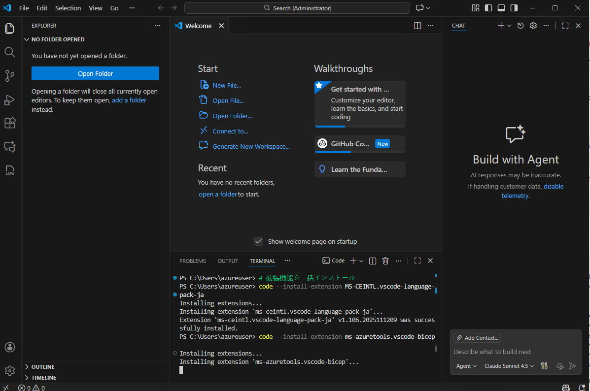
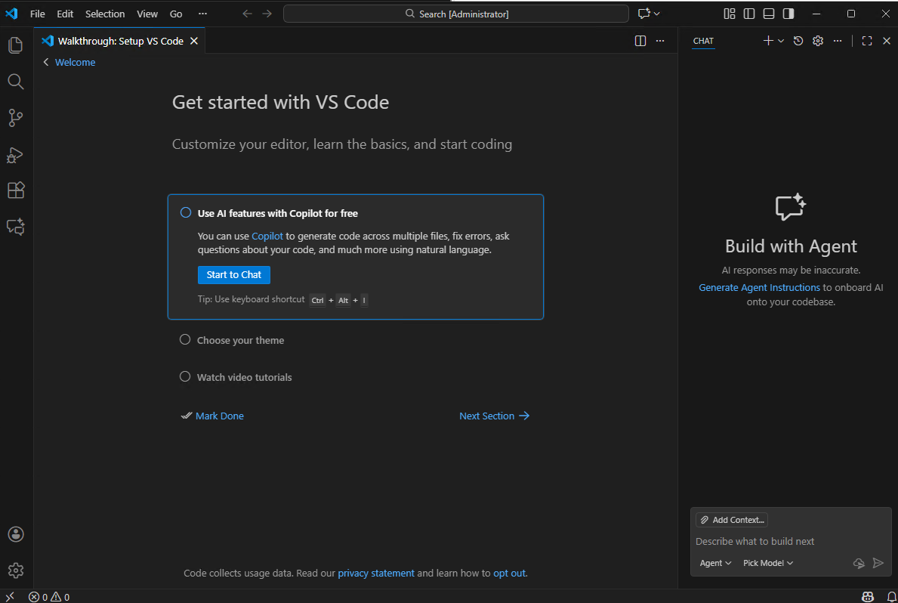
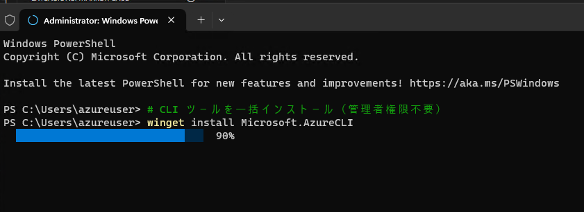
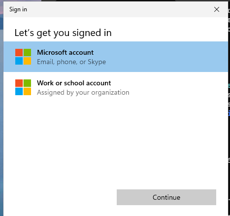
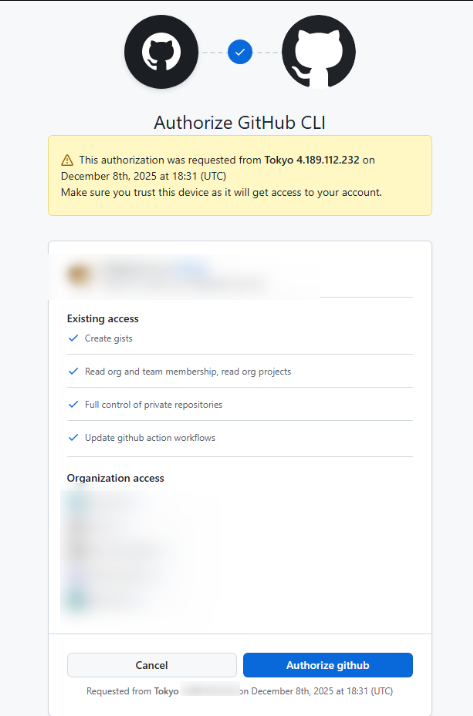
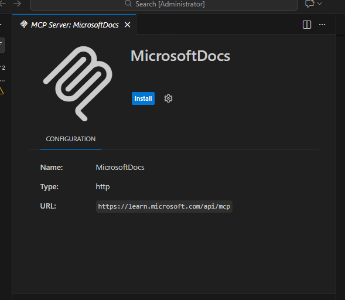

# VS Code + GitHub Copilot スターターキット

VS Code と GitHub Copilot を活用した Azure 開発環境のセットアップガイドです。  
Bicep による IaC（Infrastructure as Code）開発を AI アシスタントでスムーズに始められます。

---

## 📑 目次

- [事前準備（必須）](#事前準備必須)
  - [VS Code のインストール](#1-vs-code-のインストール)
  - [VS Code 拡張機能の導入](#2-vs-code-拡張機能の導入)
  - [CLI ツールのインストール](#3-cli-ツールのインストールazure-cli--git--github-cli)
  - [MCP サーバー (MS Learn) の設定](#4-mcp-サーバー-ms-learn-の設定)
  - [準備完了の確認](#準備完了の確認)
- [Git & GitHub 基礎ガイド](docs/git-basics.md)
- [参考リンク](#参考リンク)

---

## 事前準備（必須）

以下が揃っていれば準備完了です。

### 💻 コマンドの実行場所

本ガイドのコマンドは **PowerShell 5.1 以上** で実行します（Windows 10/11 は標準搭載）。

| 実行場所               | 開き方                                                                |
| ---------------------- | --------------------------------------------------------------------- |
| **VS Code ターミナル** | VS Code で `Ctrl + @` または メニュー → ターミナル → 新しいターミナル |
| **Windows PowerShell** | スタートメニュー → 「PowerShell」で検索                               |
| **Windows Terminal**   | スタートメニュー → 「Terminal」で検索（⭐ 推奨）                      |

#### VS Code ターミナルの開き方

1. VS Code を開く
2. 以下のいずれかでターミナルを開く：
   - キーボード: `Ctrl + @`（日本語キーボード）または `` Ctrl + ` ``（英語キーボード）
   - メニュー: **表示** → **ターミナル**
   - コマンドパレット: `Ctrl + Shift + P` → 「Terminal: Create New Terminal」



> ⭐ **推奨**: VS Code ターミナルを使うと、コード編集とコマンド実行を同じウィンドウで行えて便利です。

> ⚠️ **実行ポリシー**: スクリプト実行がブロックされる場合は、以下を実行してください。
>
> ```powershell
> Set-ExecutionPolicy -Scope CurrentUser RemoteSigned
> ```

> 💡 **管理者権限について**: 日常のコマンド実行には管理者権限は不要です。ただし、Azure CLI や Git のインストール時には管理者権限が必要です。

> 💡 **PATH の反映**: CLI ツールをインストールした後は **VS Code を再起動** してください。PATH が反映されず、コマンドが見つからない場合があります。

### 📁 VS Code 設定の優先順位

本ガイドでは「User Settings」と「Workspace Settings」の 2 種類の設定場所が登場します。

| 設定場所               | ファイル                            | 適用範囲                         |
| ---------------------- | ----------------------------------- | -------------------------------- |
| **User Settings**      | `%APPDATA%\Code\User\settings.json` | 全ワークスペース共通（個人設定） |
| **Workspace Settings** | `.vscode/settings.json`             | このプロジェクトのみ             |

**優先順位**: Workspace Settings が User Settings より優先されます。

```
User Settings（グローバル）
    ↓ 上書き
Workspace Settings（.vscode/settings.json）
```

> 💡 **使い分けのコツ**:
>
> - **User Settings**: 個人の好み（フォントサイズ、テーマなど）
> - **Workspace Settings**: プロジェクト共通ルール（フォーマッター、Bicep 設定など）
>
> チームで共有する `.vscode/settings.json` には、プロジェクトに必要な設定だけ書くのがベストです。

### 🎯 準備のゴール

| 目的                     | 作業内容                                      | 判定基準                                          |
| ------------------------ | --------------------------------------------- | ------------------------------------------------- |
| VS Code での Bicep 開発  | VS Code インストール & Bicep 拡張機能導入     | `.bicep` ファイルでシンタックスハイライトされる   |
| Copilot によるコード補完 | GitHub Copilot 拡張機能導入 & GitHub ログイン | コメントを書くと補完が動く                        |
| Azure 操作               | Azure CLI インストール & `az login`           | `az login` でログインでき、リソース作成権限がある |
| Git 管理                 | Git CLI インストール                          | `git --version` が動く                            |
| GitHub 操作              | GitHub CLI インストール & `gh auth login`     | `gh auth status` が動く                           |
| MS Learn 参照            | MCP サーバー設定                              | Copilot Chat で MS Learn が参照される             |

> ⚠️ **注意**: GitHub Copilot の利用には[ライセンス](https://github.com/features/copilot)（個人 / Business / Enterprise）が必要です。

### 1. VS Code のインストール

公式サイトからダウンロード・インストール：  
🔗 https://code.visualstudio.com/

インストール時に以下のオプションを選択してください（※英語環境での表記）：

| オプション                                                                 |  推奨   | 説明                                              |
| -------------------------------------------------------------------------- | :-----: | ------------------------------------------------- |
| Add "Open with Code" action to Windows Explorer **file** context menu      |   ✅    | ファイル右クリック →「Code で開く」               |
| Add "Open with Code" action to Windows Explorer **directory** context menu |   ✅    | フォルダ右クリック →「Code で開く」               |
| Register Code as an editor for supported file types                        |   ✅    | テキストファイルをダブルクリックで VS Code が開く |
| **Add to PATH**                                                            | ✅ 必須 | ターミナルから `code` コマンドが使える            |

> 💡 **Add to PATH** は必須です。これがないと拡張機能の一括インストールコマンドが動きません。

#### 初回起動時の設定

VS Code を初めて起動すると「Get started with VS Code」画面が表示されます。

1. **「Use AI features with Copilot for free」** をクリック → GitHub アカウントでサインイン
2. サインイン完了後、右側に **Copilot Chat パネル** が表示されます
3. 残りの項目（テーマ選択など）は任意でスキップ可能



> 💡 **ポイント**: GitHub にサインインすると、右側に「Build with Agent」パネルが表示され、Copilot Chat が使えるようになります。

### 2. VS Code 拡張機能の導入

以下の拡張機能を VS Code にインストールしてください。

| 拡張機能                                                                                                        | 用途                                                  |
| --------------------------------------------------------------------------------------------------------------- | ----------------------------------------------------- |
| [Japanese Language Pack](https://marketplace.visualstudio.com/items?itemName=MS-CEINTL.vscode-language-pack-ja) | VS Code の日本語化                                    |
| [Bicep](https://marketplace.visualstudio.com/items?itemName=ms-azuretools.vscode-bicep)                         | Bicep ファイルの編集・バリデーション                  |
| [GitHub Copilot](https://marketplace.visualstudio.com/items?itemName=GitHub.copilot)                            | AI によるコード補完                                   |
| [GitHub Copilot Chat](https://marketplace.visualstudio.com/items?itemName=GitHub.copilot-chat)                  | AI とのチャットベース開発                             |
| [Azure Resources](https://marketplace.visualstudio.com/items?itemName=ms-azuretools.vscode-azureresourcegroups) | Azure リソースのブラウズ・管理                        |
| [Azure CLI Tools](https://marketplace.visualstudio.com/items?itemName=ms-vscode.azurecli)                       | Azure CLI コマンドのシンタックスハイライト・実行      |
| [YAML](https://marketplace.visualstudio.com/items?itemName=redhat.vscode-yaml)                                  | YAML ファイルのバリデーション（CI/CD パイプライン等） |
| [Prettier](https://marketplace.visualstudio.com/items?itemName=esbenp.prettier-vscode)                          | コードフォーマッター（JSON, YAML, Markdown 整形）     |
| [GitLens](https://marketplace.visualstudio.com/items?itemName=eamodio.gitlens)                                  | Git 履歴・blame の可視化                              |

**VS Code ターミナル（PowerShell）で実行**（`Ctrl + @` でターミナルを開く）:

以下をコピーして貼り付け、Enter キーを押すと 9 つの拡張機能が順番にインストールされます。

```powershell
# 拡張機能を一括インストール
code --install-extension MS-CEINTL.vscode-language-pack-ja;
code --install-extension ms-azuretools.vscode-bicep;
code --install-extension GitHub.copilot;
code --install-extension GitHub.copilot-chat;
code --install-extension ms-azuretools.vscode-azureresourcegroups;
code --install-extension ms-vscode.azurecli;
code --install-extension redhat.vscode-yaml;
code --install-extension esbenp.prettier-vscode;
code --install-extension eamodio.gitlens
```


> 💡 **日本語化**: Japanese Language Pack インストール後、VS Code を再起動すると日本語に切り替わります。切り替わらない場合は `Ctrl + Shift + P` → 「Configure Display Language」→「ja」を選択してください。

> 💡 **GitHub Copilot のログイン**: 拡張機能インストール後、VS Code 左下の人型アイコンをクリックして GitHub アカウントでサインインしてください。

### 3. CLI ツールのインストール（Azure CLI / Git / GitHub CLI）

> ⚠️ **管理者権限の PowerShell で実行してください**（VS Code ターミナルではなく）

スタートメニュー → 「PowerShell」を右クリック → **「管理者として実行」** で開いてください。



以下をコピーして貼り付け、Enter キーを押すと 3 つのツールが順番にインストールされます（約 10 分）。

```powershell
# Azure CLI, Git, GitHub CLI を一括インストール
winget install Microsoft.AzureCLI; winget install Git.Git; winget install GitHub.cli
```

> 💡 winget が使えない場合は、各公式サイトからインストーラーをダウンロード:
>
> - Azure CLI: https://learn.microsoft.com/ja-jp/cli/azure/install-azure-cli
> - Git: https://git-scm.com/downloads
> - GitHub CLI: https://cli.github.com/

> 💡 インストール後は **VS Code を再起動** してください（PATH を反映するため）。

**インストール確認 & ログイン**（VS Code ターミナル `Ctrl + @` で実行）:

```powershell
# バージョン確認（3つとも表示されれば OK）
az --version; git --version; gh --version

# Azure CLI を最新版に更新
az upgrade

# Azure にログイン（対象サブスクリプションにリソース作成権限が必要）
az login

# GitHub にログイン
gh auth login
```

> 💡 `az login` を実行すると、ブラウザまたはサインイン画面が開きます。Azure サブスクリプションに紐づいたアカウントでサインインしてください。ログイン完了後の画面では「**いいえ、このアプリのみにサインインします**」を選択しておくと無難です。
>
> ⚠️ サインイン画面がバックグラウンドで表示されていることがあるので、見当たらない場合はタスクバーを確認してください。



> 💡 `gh auth login` を実行すると、対話形式で認証方法を選択します：
>
> 1. `Where do you use GitHub?` → **GitHub.com**
> 2. `What is your preferred protocol for Git operations?` → **HTTPS**
> 3. `Authenticate Git with your GitHub credentials?` → **Yes**
> 4. `How would you like to authenticate GitHub CLI?` → **Login with a web browser**
> 5. 表示されるワンタイムコード（例: `5669-6BF5`）をコピーして Enter
> 6. ブラウザが開くので、コードを入力して認証完了
> 7. ターミナルに `✓ Logged in as <ユーザー名>` と表示されれば成功



### 4. MCP サーバー (MS Learn) の設定

Copilot Chat から MS Learn ドキュメントを参照できるようになります。

#### 方法 1: ワンクリックインストール（⭐ 推奨）

以下のリンクをクリックすると、VS Code が開いてインストール画面が表示されます。**Install** ボタンをクリックして設定完了です。



| 設定レベル             | リンク                                                                                                                                                                                                            | 説明                                                     |
| ---------------------- | ----------------------------------------------------------------------------------------------------------------------------------------------------------------------------------------------------------------- | -------------------------------------------------------- |
| **Workspace Settings** | [Install (Workspace)](https://insiders.vscode.dev/redirect/mcp/install?name=MicrosoftDocs&config=%7B%22type%22%3A%22http%22%2C%22url%22%3A%22https%3A%2F%2Flearn.microsoft.com%2Fapi%2Fmcp%22%7D&scope=workspace) | ⭐ **推奨**: このプロジェクトのみで有効                  |
| **User Settings**      | [Install (User)](https://insiders.vscode.dev/redirect/mcp/install?name=MicrosoftDocs&config=%7B%22type%22%3A%22http%22%2C%22url%22%3A%22https%3A%2F%2Flearn.microsoft.com%2Fapi%2Fmcp%22%7D)                      | 全ワークスペースで有効（Microsoft 技術をよく使う人向け） |

> 💡 **推奨理由**: Workspace Settings にすると `.vscode/mcp.json` がリポジトリに含まれ、チームメンバーも同じ設定を共有できます。

> 📖 詳細: [MS Learn MCP Server - GitHub](https://github.com/microsoftdocs/mcp)

#### 方法 2: 手動設定

**Workspace Settings（このプロジェクトのみ）**

`.vscode/mcp.json` を作成し、以下の内容をコピー：  
📄 [samples/mcp-workspace.json](samples/mcp-workspace.json)

**User Settings（全ワークスペース共通）**

`Ctrl + Shift + P` → `Preferences: Open User Settings (JSON)` を開き、以下の内容を追加：  
📄 [samples/mcp-user-settings.json](samples/mcp-user-settings.json)

> 💡 **優先順位**: Workspace Settings（`.vscode/mcp.json`）が User Settings より優先されます。

### 準備完了の確認

以下がすべて OK なら準備完了です。

**VS Code ターミナル（PowerShell）で実行**:

```powershell
# 1. Azure CLI が使える
az account show --query "{Subscription:name, User:user.name}" -o table
# → エラーの場合: az login を実行してログイン

# 2. Git CLI が使える（git version 2.x.x のようにバージョンが表示される）
git --version

# 3. GitHub CLI が使える
gh auth status
# → エラーの場合: gh auth login を実行してログイン
```

**4. GitHub Copilot が有効**

VS Code で新規ファイル（例: `test.js`）を作成し、コメントを入力すると Copilot が補完候補を提案します。

```javascript
// 1から10までの合計を計算する関数
// ↑ このようなコメントを書くと、Copilot が関数を提案してくれます
```

**5. Bicep 拡張が動作**

`.bicep` ファイルを開いてシンタックスハイライト（色分け）が表示されれば OK です。

```bicep
// 例: test.bicep を作成して以下を貼り付け
resource storageAccount 'Microsoft.Storage/storageAccounts@2023-01-01' = {
  name: 'mystorageaccount'
  location: 'japaneast'
  sku: {
    name: 'Standard_LRS'
  }
  kind: 'StorageV2'
}
```

**6. MCP サーバーが有効**

Copilot Chat で Azure や Bicep について質問し、MS Learn のドキュメントが参照されれば OK です。

1. `Ctrl + Alt + I` で Copilot Chat を開く
2. 「Bicep でストレージアカウントを作成する方法を教えて」と質問
3. 回答に MS Learn のリンクが含まれていれば設定完了

---

## 参考リンク

- [Bicep ドキュメント](https://learn.microsoft.com/ja-jp/azure/azure-resource-manager/bicep/)
- [GitHub Copilot ドキュメント](https://docs.github.com/ja/copilot)
- [Azure CLI ドキュメント](https://learn.microsoft.com/ja-jp/cli/azure/)
- [GitHub CLI ドキュメント](https://cli.github.com/manual/)
